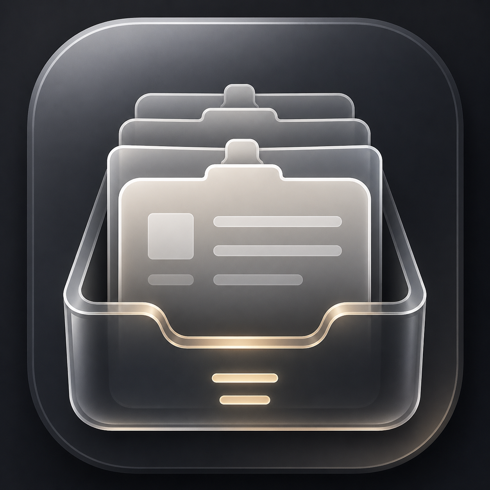

# ClipSpot

ClipSpot is a native macOS clipboard manager built for fast, local-first workflows. It keeps a searchable archive of copied text, images, videos, and file references directly in your menu bar, without turning your clipboard history into a cloud product.



## Why ClipSpot

Most clipboard managers treat everything like plain text. ClipSpot is designed for modern Mac usage, where copied content often includes screenshots, images, videos, design assets, documents, and file references alongside text snippets.

ClipSpot focuses on:

- Native macOS menu bar workflow
- Local persistence with no cloud dependency
- Type-aware clipboard history for text, images, videos, and files
- Fast keyboard navigation and filtering
- Clear handling for missing file references

## Features

- **Clipboard archive**
  ClipSpot stores recent clipboard history locally so copied items stay easy to recover.

- **Media-aware history**
  Text, images, videos, and file references are recognized and grouped by content type.

- **Real-time file reference behavior**
  Media files are stored as live references, not duplicated into an internal library. If the original file is deleted or moved, ClipSpot surfaces that clearly.

- **Keyboard-first usage**
  Search, filter, move through visible results, and copy back from the keyboard without breaking flow.

- **Finder integration**
  File-based clips can be revealed directly in Finder.

- **Local-first privacy**
  Clipboard history remains on your Mac.

## Download

Download the latest public installer here:

[Download ClipSpot.dmg](https://github.com/rumi7911/ClipSpot/raw/main/downloads/ClipSpot.dmg)

## First Launch on macOS

If macOS blocks the app on first launch because of Gatekeeper or quarantine attributes, remove the quarantine flag with:

```bash
xattr -dr com.apple.quarantine /Applications/ClipSpot.app
```

Run that only after you have moved `ClipSpot.app` into `/Applications`.

## Project Structure

```text
Sources/ClipboardShelf/     Swift source for the macOS app
Tests/ClipboardShelfTests/  Unit tests
assets/                     App branding assets
script/                     Local build and packaging scripts
```

## Development

### Requirements

- macOS
- Xcode Command Line Tools or Xcode
- Swift 6 toolchain compatible with the package

### Run tests

```bash
cd /Users/rumipro/Documents/MacApps/ClipSpot
DEVELOPER_DIR=/Applications/Xcode.app/Contents/Developer \
CLANG_MODULE_CACHE_PATH="$PWD/.build/ModuleCache" \
SWIFTPM_MODULECACHE_OVERRIDE="$PWD/.build/ModuleCache" \
swift test --disable-sandbox
```

### Build the app bundle

```bash
cd /Users/rumipro/Documents/MacApps/ClipSpot
./script/build_and_run.sh --bundle
```

### Package the DMG

```bash
cd /Users/rumipro/Documents/MacApps/ClipSpot
./script/package_dmg.sh
```

## Notes

- The repo tracks a public installer at `downloads/ClipSpot.dmg` for direct website downloads.
- The packaging script contains a fallback path for environments where mounted DMG creation is restricted.

## License

This project is available under the [MIT License](LICENSE).
